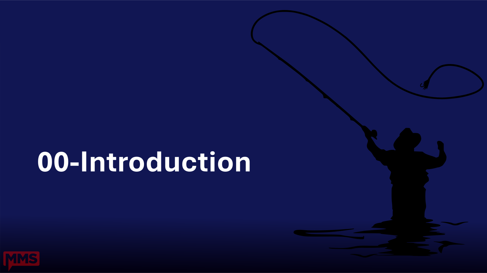
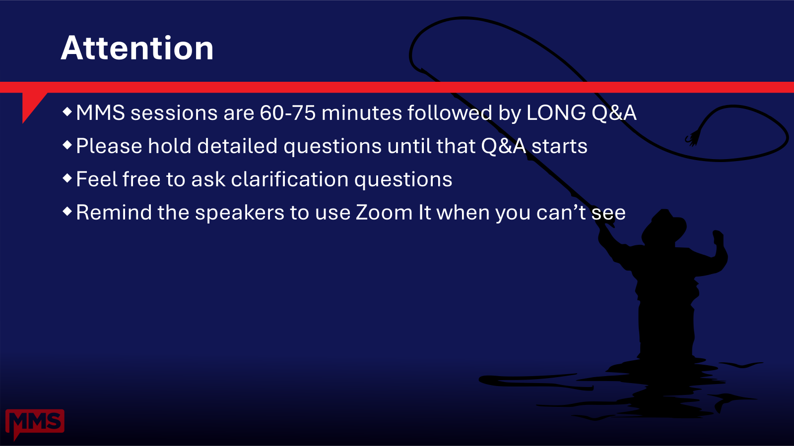

# 00 - Introduction

**Time:** 0 - 5 minutes
**Owner:** David

Set the stage: who we are, why this session, and what attendees will walk away with.

## Objectives

- Introduce the speakers and their context.
- Frame the session as a fresh-install playbook for PowerShell + VS Code.
- Confirm the agenda and the deliverable starter profile.
- Surface prerequisites for hands-on follow-along.

## Talking points

1. Welcome to MMS at MOA. Thank attendees for choosing this session over a competing slot.
2. Quick speaker intros (45 seconds each, see [speakers.md](./speakers.md)).
3. Why this session exists: every PowerShell author re-invents their VS Code setup; we will give you ours.
4. The pitch: by the end you have (a) a starter profile you can import, (b) a settings baseline you can defend, (c) a working GitHub flow, (d) Copilot configured for PowerShell.
5. Show the agenda slide ([agenda.md](./agenda.md)).
6. Call out the format: 60 minutes content, 45 minutes Q&A. We will not rush.
7. Prereqs callout for hands-on attendees ([prerequisites.md](./prerequisites.md)). It is fine to just watch.

## Subtopics

- [speakers.md](./speakers.md) - speaker bios and split
- [conference.md](./conference.md) - event metadata
- [agenda.md](./agenda.md) - the 5-section roadmap
- [prerequisites.md](./prerequisites.md) - what to install to follow along

## Demo

None in this section. Have VS Code already open on the projector with the starter profile loaded so attendees see the destination state.

[Back to root](../README.md)
