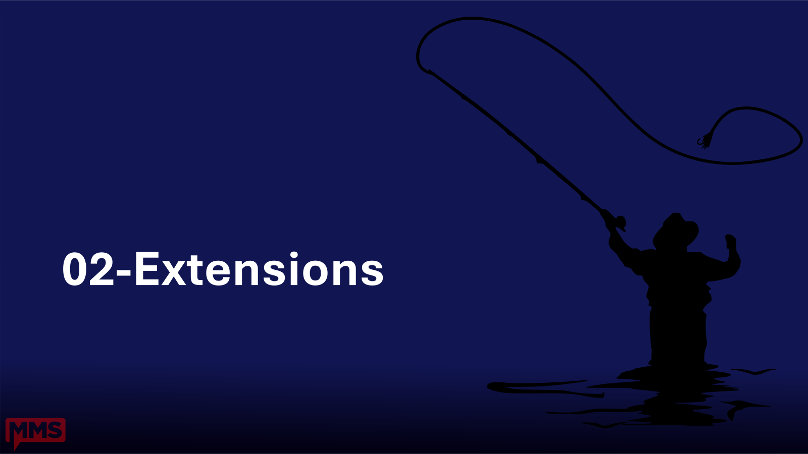



# 02 - Extensions

**Time:** 13 - 18 minutes (5 min)
**Owner:** David
**Goal:** Install a short, defensible list of extensions so every subsequent demo has the tools it needs.

## Why this section comes before Settings

Extensions that are not installed cannot be configured. Getting the extension list in first means the Settings section can immediately demo PSScriptAnalyzer, CodeLens, and the Integrated Console without interruption.

## Outcomes

By the end of this section attendees can:

1. Install extensions individually and in bulk from the Extensions view.
2. Name the essential extensions for PowerShell work and explain why each is on the list.
3. Commit a `.vscode/extensions.json` file to recommend extensions to teammates.

## Subtopics

- [essential-extensions.md](./essential-extensions.md) - curated list and bulk install script

## Demo outline

1. Press `Ctrl+Shift+X` to open the Extensions view.
2. Search for `ms-vscode.powershell`. Show the extension card; do NOT install yet.
3. Open the integrated terminal (`Ctrl+backtick`).
4. Paste and run the bulk install script from [essential-extensions.md](./essential-extensions.md).
5. Return to the Extensions view. Press `Ctrl+Shift+X` and type `@installed` to show all installed extensions.
6. Reload the window when VS Code prompts.

**Fallback (no internet / slow conference Wi-Fi):** Switch to the pre-loaded profile that already has these extensions installed. Show the `@installed` list and the bulk script as reference only.

## Talking points

- This is the same list baked into the starter profile in `Samples/extensions.txt`. Import the profile instead of running the script if you want to skip the live install.
- The PowerShell extension is the only truly required one. Everything else is high-leverage but optional.
- Fewer extensions = faster startup. Resist the urge to install 40 extensions.

[Back to root](../README.md)
