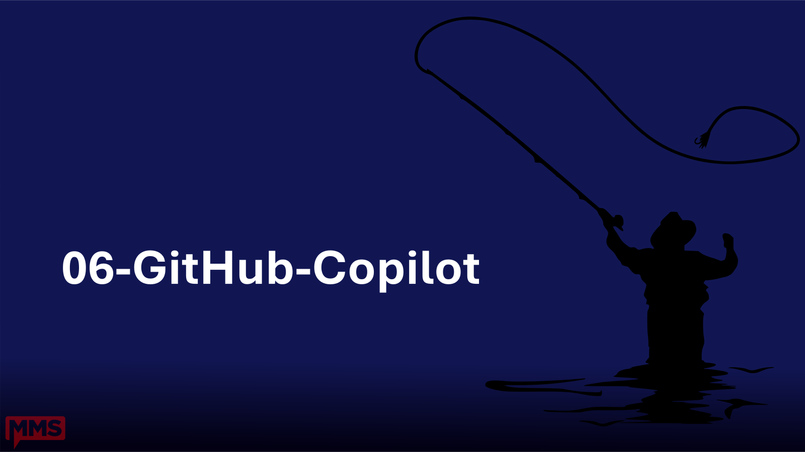

# 06 - GitHub Copilot

**Time:** 55 - 65 minutes (10 min)
**Owner:** Jeff
**Learning objective:** Set up GitHub Copilot for advanced PowerShell coding assistance.

## Outcomes

By the end of this section attendees can:

1. Sign in to Copilot and pick a plan that fits.
2. Use inline completions while authoring PowerShell.
3. Use Copilot Chat in Ask, Edit, and Agent modes.
4. Write effective prompts for PowerShell tasks.
5. Customize Copilot with `copilot-instructions.md`, prompt files, and AGENTS.md.
6. Apply safety practices: review every diff, never trust generated secrets.

## Subtopics

- [setup-and-licensing.md](./setup-and-licensing.md)
- [inline-completions.md](./inline-completions.md)
- [copilot-chat.md](./copilot-chat.md)
- [powershell-prompts.md](./powershell-prompts.md)
- [custom-instructions.md](./custom-instructions.md)
- [safety-and-review.md](./safety-and-review.md)

## Demo outline

1. Show Accounts -> Copilot status. Sign in if needed (auto if already signed into GitHub).
2. Open `Demos/MyDemoModule/MyDemoModule.psm1`. Type a function comment and let Copilot complete a `Get-DemoVersion` body.
3. Open Copilot Chat (`Ctrl+Alt+I`). Ask: "Explain what this module does."
4. Use the `/tests` slash command in a Pester file to generate a new test.
5. Switch to Edit mode. Ask Copilot to add comment-based help to every public function. Review and accept the multi-file diff.
6. Open this repo's [.github/copilot-instructions.md](../.github/copilot-instructions.md). Show how it scoped Copilot to use ASCII and the per-subtopic template throughout this very repo.
7. Open a prompt file (`.github/prompts/new-function.prompt.md` if shipped) and run it.

**Fallback:** if Copilot service is degraded, demo Ask mode against open files only and show the customization files statically.

## Talking points

- Copilot suggests; you decide. Treat output like a junior pair, not authority.
- Inline completions are great for boilerplate; Chat is great for explanation and refactors.
- Custom instructions are how you make Copilot match your team's PowerShell style.
- Workspace Trust gates Copilot Agent mode actions in untrusted folders.

## References

- Copilot in VS Code: https://code.visualstudio.com/docs/copilot/overview
- Plans: https://github.com/features/copilot/plans
- Custom instructions: https://docs.github.com/en/copilot/customizing-copilot/about-customizing-github-copilot-chat-responses

[Back to root](../README.md)
