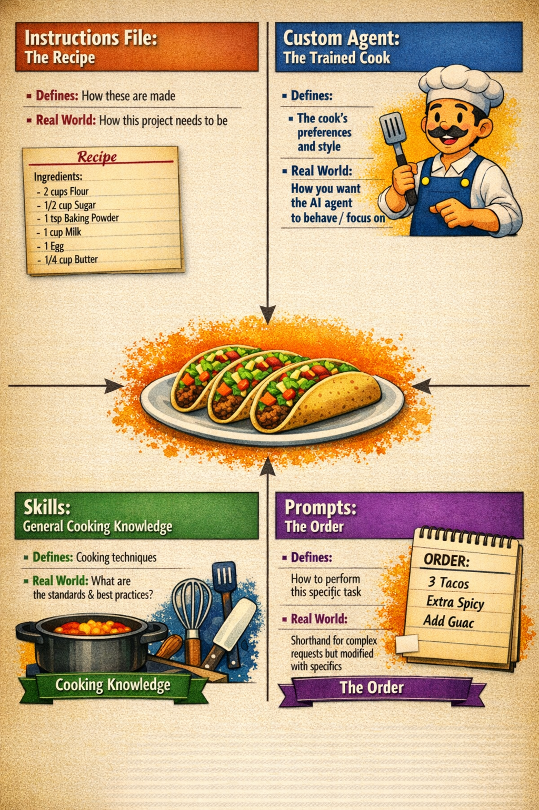

# Enhancing Copilot: Skills, Instructions, Prompts, Agents, Hooks, and MCP

## Purpose

Move beyond default chat behavior by wiring Copilot into your team's conventions,
tools, and workflows.



## Why it matters

Out of the box, Copilot knows nothing about your module structure, coding standards,
or external APIs. The features below let you inject that context once so every chat
session and every agent run inherits it automatically.

## Enhancement layers

| Layer | File / mechanism | Scope | When to use |
|-------|-----------------|-------|-------------|
| Repo instructions | `.github/copilot-instructions.md` | All chat in the workspace | Enforce team coding standards globally |
| Scoped instructions | `*.instructions.md` with `applyTo` frontmatter | Matching file globs | Different rules for tests vs. source |
| Prompt files | `.github/prompts/*.prompt.md` | On demand via `/` in chat | Repeatable multi-step tasks |
| Skills | `.github/skills/*.md` (or `SKILL.md`) | On demand; agent loads at runtime | Package domain knowledge for reuse |
| Custom agents | `.github/agents/*.agent.md` | Invoked by name in chat | Specialized workflows with fixed tools |
| Background agents | GitHub.com -> Copilot -> Assign issue | Cloud, async, no local IDE | Long-running tasks while you do other work |
| Hooks | `.github/hooks/*.json` | Active workspace or agent | Run shell commands at agent lifecycle points |
| MCP servers | `settings.json` or `.vscode/mcp.json` | Active workspace | Connect Copilot to external tools and APIs |

## Skills

A skill is a Markdown file that teaches Copilot a domain-specific process.
When an agent needs to perform a task matching the skill's description, it reads the
file and follows the instructions inside it.

Example: a `pester-test-pattern.md` skill that describes your module's Pester 5
structure. Copilot reads it before generating tests so output matches your layout.

```markdown
---
description: >
  Writing Pester 5 tests for MyDemoModule. USE FOR: any /tests request
  in Demos/MyDemoModule/. Describes file location, naming, and BeforeAll pattern.
---

# Pester 5 test conventions for MyDemoModule

- Test files live in Demos/MyDemoModule/Tests/ and are named <Function>.Tests.ps1.
- Use BeforeAll { Import-Module $PSScriptRoot\..\..\MyDemoModule.psd1 -Force }.
- One Describe block per public function, one Context per scenario.
- Mock private functions via InModuleScope.
```

## Instructions files

`copilot-instructions.md` is a single file that applies to every chat.
`.instructions.md` files with an `applyTo` frontmatter glob apply only to matching files.

```markdown
---
applyTo: "Demos/MyDemoModule/Tests/**"
---

All test files use Pester 5 syntax. Do not use Should -Be without -ActualValue.
```

This lets you enforce different rules for tests, public functions, and CI scripts
without one monolithic file.

## Prompt files

A prompt file is a reusable chat script stored in `.github/prompts/`.
You invoke it in chat by typing `/` followed by the file name (without `.prompt.md`).

```markdown
---
mode: agent
description: Scaffold a new public cmdlet and its Pester test.
---

Ask me for the function name (Verb-Noun) and a one-line synopsis.

Then:
1. Create Public/<FunctionName>.ps1 using [CmdletBinding()], param block, and comment-based help.
2. Create Tests/<FunctionName>.Tests.ps1 with a Describe block and at least two It blocks.
3. Add the function name to the FunctionsToExport list in the module manifest.
```

Run it in agent mode and Copilot will prompt you for the inputs, then create all three
files and update the manifest in one pass.

## Custom agents

An agent file (`.github/agents/*.agent.md`) defines a named agent with a fixed
system prompt, tool set, and mode. It shows up in the model picker in the chat panel.

```markdown
---
name: PSReviewer
description: Reviews PowerShell files for PSScriptAnalyzer violations and style.
tools:
  - read_file
  - run_in_terminal
---

You are a PowerShell code reviewer. When given a file path:
1. Read the file.
2. Run Invoke-ScriptAnalyzer against it.
3. Report violations grouped by severity.
4. Suggest fixes for each Warning or Error.
```

## Background agents

Background agents run on GitHub's cloud infrastructure, not in your local IDE.
You assign a GitHub issue to Copilot from the GitHub web UI or from the Copilot
Coding Agent tab. Copilot opens a branch, makes changes, and opens a pull request
when it is done.

Use background agents for:
- Tasks that take more than a few minutes
- Work you want to delegate while you focus elsewhere
- Bulk changes across many files

Review the resulting pull request just as you would any contributor's PR. The diff
is the ground truth; the agent's description is just context.

Requires: GitHub Copilot Enterprise or a plan that includes Copilot coding agents.

## MCP servers

Model Context Protocol (MCP) lets Copilot call external tools through a standardized
interface. An MCP server exposes tools (functions Copilot can call), resources (data
it can read), and prompts (templates it can invoke).

Configure MCP servers in `.vscode/mcp.json` (workspace) or in user `settings.json`:

```json
{
    "mcp": {
        "servers": {
            "MyApi": {
                "type": "http",
                "url": "https://my-internal-api/mcp"
            },
            "filesystem": {
                "type": "stdio",
                "command": "npx",
                "args": ["-y", "@modelcontextprotocol/server-filesystem", "${workspaceFolder}"]
            }
        }
    }
}
```

Once registered, MCP tools appear in the Tools picker in agent mode. Copilot can
call them automatically when they are relevant to the prompt.

Common MCP use cases:
- Query an internal package catalog or CMDB
- Run scripts against a test environment
- Pull data from REST APIs without leaving chat

## Hooks

Hooks run shell commands at specific points in an agent session. Unlike instructions
that guide Copilot's behavior through text, hooks execute code with guaranteed
outcomes regardless of how the agent was prompted.

Hook files live in `.github/hooks/*.json`. VS Code loads all `*.json` files in
that folder automatically.

### Lifecycle events

| Event | When it fires | Useful for |
|-------|--------------|------------|
| `SessionStart` | First prompt of a new session | Inject project context, validate environment |
| `UserPromptSubmit` | User submits any prompt | Audit requests, enforce prompt policies |
| `PreToolUse` | Before any tool call | Block dangerous operations, require approval |
| `PostToolUse` | After a tool completes | Run formatters, linters, or tests |
| `PreCompact` | Before context is compacted | Export important state |
| `SubagentStart` | Subagent is spawned | Initialize subagent resources |
| `SubagentStop` | Subagent finishes | Aggregate results |
| `Stop` | Session ends | Generate reports, clean up |

### PowerShell example: auto-format after every file edit

Create `.github/hooks/format.json`:

```json
{
    "hooks": {
        "PostToolUse": [
            {
                "type": "command",
                "windows": "pwsh -NoProfile -Command Invoke-Formatter -ScriptDefinition (Get-Content $env:TOOL_INPUT_FILE_PATH -Raw) | Set-Content $env:TOOL_INPUT_FILE_PATH",
                "command": "pwsh -NoProfile -Command Invoke-Formatter -ScriptDefinition (Get-Content $TOOL_INPUT_FILE_PATH -Raw) | Set-Content $TOOL_INPUT_FILE_PATH",
                "timeout": 20
            }
        ]
    }
}
```

### PowerShell example: block dangerous commands

Create `.github/hooks/block-dangerous.json`:

```json
{
    "hooks": {
        "PreToolUse": [
            {
                "type": "command",
                "windows": "pwsh -NoProfile -File .github/hooks/scripts/Check-ToolInput.ps1",
                "command": "pwsh -NoProfile -File .github/hooks/scripts/Check-ToolInput.ps1",
                "timeout": 10
            }
        ]
    }
}
```

The script reads JSON from stdin, inspects the `tool_name` and `tool_input` fields,
and exits with code `2` to block or `0` to allow. Stderr is shown to the model as
context when exit code is `2`.

### Inject project context at session start

```json
{
    "hooks": {
        "SessionStart": [
            {
                "type": "command",
                "windows": "pwsh -NoProfile -Command Write-Output '{\"hookSpecificOutput\":{\"hookEventName\":\"SessionStart\",\"additionalContext\":\"Module: MyDemoModule | PS 7 required | OTBS formatting | Pester 5 tests\"}}'" ,
                "timeout": 5
            }
        ]
    }
}
```

### Create a hook with AI

Type `/create-hook` in chat and describe the automation you want. Copilot generates
the JSON file, asks clarifying questions, and places it in `.github/hooks/`.

Alternatively, open the Command Palette (`Ctrl+Shift+P`) and run
**Chat: Configure Hooks**, or type `/hooks` in the chat input.

## Demo steps

1. Open `.github/copilot-instructions.md` in this repo. Show the `applyTo`-style
   rules and how they shaped this session's content and formatting.
2. Create `.github/prompts/new-function.prompt.md` live. Save it.
   In chat, type `/new-function` and run the prompt for `Get-DemoHealth`.
3. Create `.github/hooks/format.json` with a `PostToolUse` hook that runs
   `Invoke-Formatter`. Ask Copilot agent mode to edit a function; verify the
   formatter fires automatically. Check the GitHub Copilot Chat Hooks output channel.
4. Type `/create-hook` in chat. Describe: "Run PSScriptAnalyzer after every file
   edit and report violations." Accept the generated hook file.
5. Show the `.vscode/mcp.json` file (or create a minimal example with the filesystem
   server). Open the Tools picker in agent mode and point out the registered tool.
6. Navigate to GitHub.com -> a repo -> Issues. Assign an issue to Copilot to show
   the background agent entry point (no live run needed; demo the UI only).

## Gotchas

- Prompt files and skills only load if workspace indexing is enabled. Turn it on
  in Settings: `"github.copilot.chat.indexing.enabled": true`.
- Background agents need write access to the repo and a billing plan that includes
  coding agents. Check plan limits before relying on them at scale.
- MCP servers run arbitrary code on your machine (stdio type) or make network calls
  (http type). Review the server source before adding it to a shared workspace config.
- `AGENTS.md` at the repo root is read by background agents on GitHub but not
  automatically by VS Code Copilot Chat. Use `.github/copilot-instructions.md` for
  VS Code and `AGENTS.md` for GitHub-side agents if you need both.
- Hooks execute shell commands with the same permissions as VS Code. Treat hook
  files from untrusted sources the same as untrusted scripts. Validate all input
  that flows from the agent into your hook scripts.
- Hooks are currently in Preview. Configuration format may change.
- If the agent can edit files that your hook scripts read, it can influence its
  own hook behavior. Use `chat.tools.edits.autoApprove` to prevent the agent from
  editing hook scripts without manual approval.

## References

- Custom instructions: https://docs.github.com/en/copilot/customizing-copilot/about-customizing-github-copilot-chat-responses
- Prompt files: https://code.visualstudio.com/docs/copilot/copilot-customization#_reusable-prompt-files-experimental
- Agent customization: https://code.visualstudio.com/docs/copilot/copilot-customization
- Copilot coding agent (background): https://docs.github.com/en/copilot/using-github-copilot/using-copilot-coding-agent-to-work-on-tasks
- MCP in VS Code: https://code.visualstudio.com/docs/copilot/chat/mcp-servers
- MCP specification: https://modelcontextprotocol.io
- Agent hooks: https://code.visualstudio.com/docs/copilot/customization/hooks
