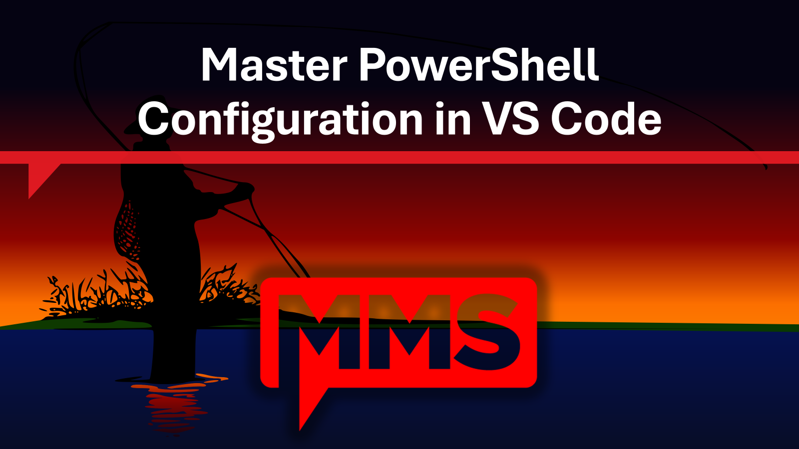

# Master PowerShell Configuration in VS Code

Materials for the MMSMOA 2026 session of the same name.

- **Event:** MMS 2026 at MOA
- **When:** Monday, May 4, 2026, 3:00 PM - 4:45 PM CDT
- **Where:** Cedar
- **Format:** 68 minutes content + live demos, followed by 37 minutes Q&A
- **MMSMOA URL:** https://mms2026atmoa.sched.com/event/2HHGJ
- **Speakers:** David Segura and Jeff Scripter (Recast Software)

## Description

A practical, fresh-install approach to configuring VS Code for PowerShell. We start from a clean install and build out profiles, recommended settings, essential extensions, GitHub integration, and GitHub Copilot. Attendees leave with a customizable starter profile, synchronized settings, trusted remotes, and a strategic path to enhance PowerShell editing, version control, and AI-assisted code authoring.

## What you will learn

1. Create and manage customized VS Code profiles designed for effective PowerShell work.
2. Implement recommended settings, including formatting and security, as well as essential PowerShell extensions.
3. Integrate VS Code with GitHub for efficient cloning, branching, committing, and change review.
4. Set up GitHub Copilot for advanced PowerShell coding assistance.

## Session outline and timing

| Time (min) | Section                                                    | Owner |
| ---------- | ---------------------------------------------------------- | ----- |
| 0 - 5      | [00 Introduction](./00-Introduction/README.md)             | David |
| 5 - 13     | [01 Getting Started](./01-Getting-Started/README.md)       | Jeff  |
| 13 - 18    | [02 Extensions](./02-Extensions/README.md)                 | David |
| 18 - 30    | [03 Profiles](./03-Profiles/README.md)                     | David |
| 30 - 43    | [04 Settings](./04-Settings/README.md)                     | David |
| 43 - 55    | [05 GitHub Integration](./05-GitHub-Integration/README.md) | Jeff  |
| 55 - 65    | [06 GitHub Copilot](./06-GitHub-Copilot/README.md)         | Jeff  |
| 65 - 68    | [07 Wrap-Up](./07-Wrap-Up/README.md)                       | Both  |
| 68 - 105   | Q&A                                                        | Both  |

Speaker split is a proposal; confirm before final rehearsal.

## Repository layout

- [.github/copilot-instructions.md](./.github/copilot-instructions.md) - guidance for AI assistants working in this repo
- [00-Introduction/](./00-Introduction/) - speakers, conference, agenda, prerequisites
- [01-Getting-Started/](./01-Getting-Started/) - Getting started with VS Code
- [02-Extensions/](./02-Extensions/) - essential extensions list and bulk install
- [03-Profiles/](./03-Profiles/) - learning objective 1
- [04-Settings/](./04-Settings/) - learning objective 2
- [05-GitHub-Integration/](./05-GitHub-Integration/) - learning objective 3
- [06-GitHub-Copilot/](./06-GitHub-Copilot/) - learning objective 4
- [07-Wrap-Up/](./07-Wrap-Up/) - takeaways, resources, Q&A prep
- [Samples/](./Samples/) - shippable starter VS Code profile (settings, extensions list, snippets)
- [Demos/MyDemoModule/](./Demos/MyDemoModule/) - sample PowerShell module used in the GitHub demo
- `Presentation/` - slide deck placeholders (not maintained here)

## Prerequisites for attendees

To follow along live, attendees should have:

- Windows 11 (macOS / Linux work too; demos are Windows)
- VS Code (stable) installed
- PowerShell 7.x installed (`winget install Microsoft.PowerShell`)
- Git for Windows installed (`winget install Git.Git`)
- A GitHub account
- Optional: a GitHub Copilot subscription (Free, Pro, Business, or Enterprise)

See [00-Introduction/prerequisites.md](./00-Introduction/prerequisites.md) for the full list and one-shot install commands.

## Starter profile

The `Samples/` directory contains the source-of-truth assets for the starter VS Code profile we hand out at the session:

- `settings.json` - recommended settings
- `extensions.txt` - extension IDs to install
- `snippets/powershell.json` - PowerShell snippets
- `mmsmoa26.code-profile` - exported profile (generated at prep time)

See [Samples/README.md](./Samples/README.md) for how it is built and imported.

## Demo repo

The `Demos/MyDemoModule/` directory is a tiny PowerShell module used during the GitHub Integration demo (clone, branch, commit, PR). See [Demos/MyDemoModule/README.md](./Demos/MyDemoModule/README.md).

## License and reuse

Materials are provided for attendee learning and reuse. Adapt freely for your own team. Trademarks and product names belong to their respective owners.
